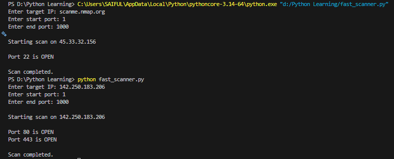
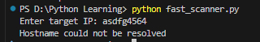

# Multithreaded Port Scanner

A Python-based TCP port scanner that uses multithreading to scan ports quickly.

## Features
- Multithreaded scanning
- Timeout handling
- Custom port range
- Detect open ports

## Technologies
- Python
- Socket Programming
- Multithreading

## Installation

git clone https://github.com/abhishektambe980/Multithreaded_port_scanner.git

cd Multithreaded_port_scanner

## Usage
python fast_scanner.py

## Example Scan

## Invalid Host Handling

